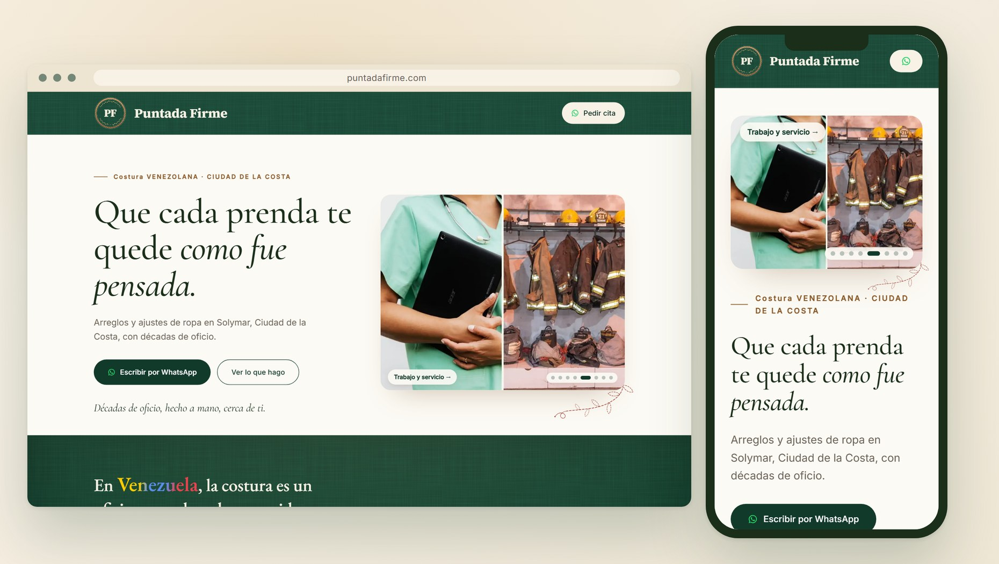

  

### Cloth, thread, and patience.

A sewing house in Solymar, Ciudad de la Costa. 
Alterations, uniforms, children's clothing, and the party dress that needs one last fix before Saturday.

---

---

## The brief

The roots of this workshop run three countries deep, and the vision arrived complete; fitting it on a page was the easy half. An online store, a booking calendar, a price list, a contact form: each was argued through and set aside, because each put a step between a person holding a garment and an answer, and none would earn back what it cost to keep alive. What is left is the craft itself, and one way to reach it.

## Under the hood

One static page. HTML, four typefaces, and [Leaflet](https://leafletjs.com) for the coverage map over Ciudad de la Costa. Every push to `main` is checked before it ships, and a check that fails leaves the live site exactly as it was.

Palette, conventions, image licences and open work: [CLAUDE.md](CLAUDE.md).

## Requirements

- A text editor. There is no build step and nothing to install.
- Python 3, to run `.github/scripts/check.py` before pushing.
- A GitHub account with Pages enabled, to publish.

## License

&copy; 2026 [Luis Barral](https://barral.dev). All rights reserved. The code is public to read, not to reuse: copying or adapting it needs written permission. See [LICENSE](LICENSE).

The brand, the copy and the photography belong to the client and are not covered by it.

**[Luis Barral](https://barral.dev)** &middot; All rights reserved

co-assisted by <b>Claude Opus 5</b>

